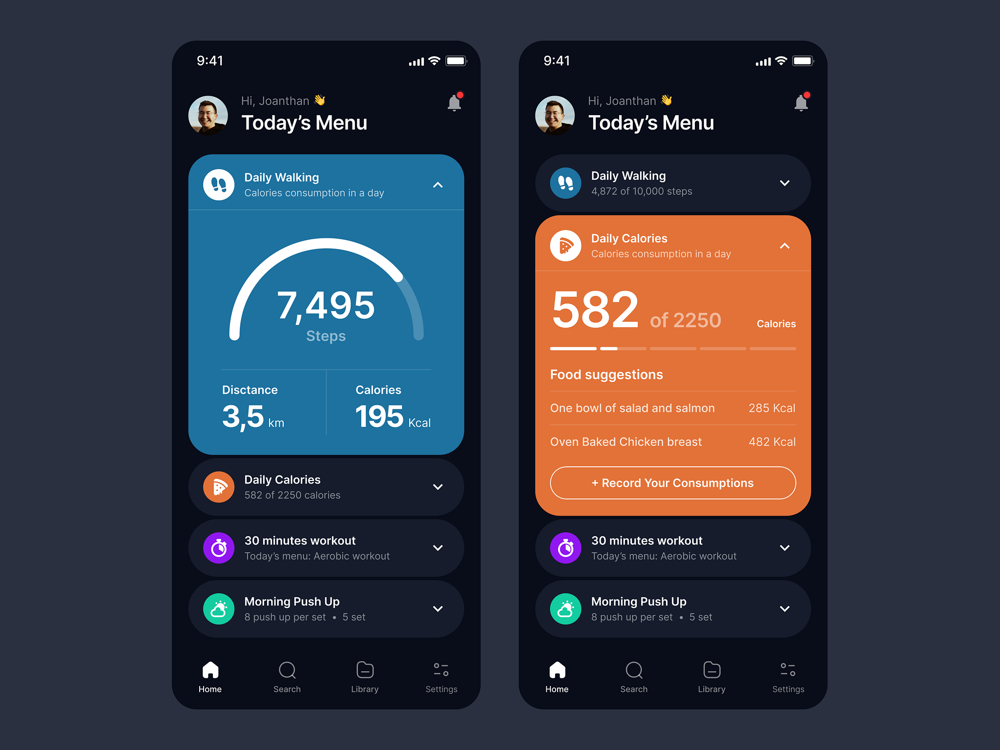

# PGD Mauritius Android Test
### Recipes Mobile App UI Design in Jetpack Compose 

You will have to build an application 
where you will have to design using JetPack compose. 
A screenshot of the design is available in the app folder. 
Used the best jetpack compose technics to achieve your goal.

in the data folder. The Data Structure and Resource is already given.

Main elements of the screen
- Scrollable top app bar with big image and scroll-to-fade feature.
- Interactive serving calculator.
- List of ingredients.
- Custom buttons.
- List of images.

### Preview

